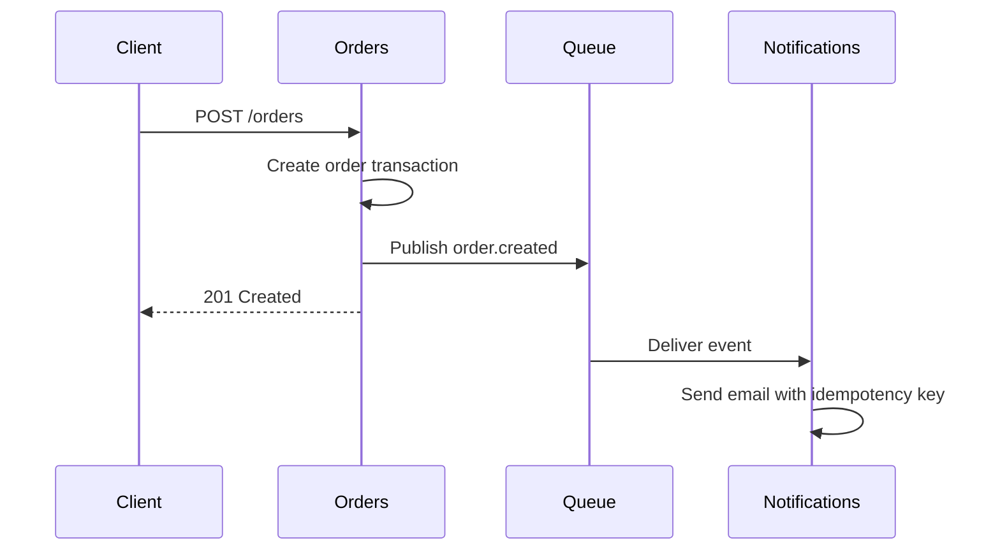

# Architecture Examples

Use these examples to calibrate decision depth, option quality, and consequence honesty.

## Example 1: Checkout Notification Boundary

### Input

A team asks whether to move transactional notifications out of the orders service. Current facts:

- `POST /orders` creates an order and sends email synchronously.
- Email provider p95 latency has grown from 180ms to 900ms.
- Failed email retries currently retry the whole order handler.
- The team can operate one extra worker but does not want a service mesh.
- Product accepts eventual email delivery if checkout remains reliable.

### Weak Output

```text
Use microservices for notifications because it is more scalable and modern. Add a queue and a new service.
```

### Why This Is Weak

- It jumps to an architecture style instead of comparing options.
- It does not mention the current approach as an option.
- It hides the operational cost of another deployable.
- It does not record the accepted trade-off: eventual consistency.

### Strong Output

```md
## ADR: Publish order notifications asynchronously

**Status:** Proposed
**Decision question:** Should checkout send transactional notifications synchronously or publish an event for asynchronous delivery?

### Context
Order creation currently calls the email provider before returning `201 Created`. Provider latency now dominates checkout p95, and email retry behavior is coupled to order creation retry behavior. Product accepts eventual email delivery when the order itself is created successfully.

### Decision Drivers
- Keep checkout p95 below the existing service target.
- Avoid retrying order creation when only notification delivery failed.
- Keep operational complexity within what the team can support.
- Preserve a clear audit path for notification attempts.

### Considered Options
1. Keep notifications inside orders.
   - Pros: one deployable, no new event contract, easiest debugging path.
   - Cons: checkout remains coupled to provider latency and retry behavior.
2. Publish `order.created` and handle notifications in a worker.
   - Pros: checkout returns after durable order creation, retries are isolated, SMS/email expansion has a boundary.
   - Cons: delivery becomes eventually consistent, event schema and dead-letter handling are required.
3. Extract a synchronous notifications service.
   - Pros: clear ownership boundary.
   - Cons: checkout still waits on a network call and the team adds a deployable without removing the latency coupling.

### Decision Outcome
Chosen: publish `order.created` and handle notifications in a worker, because checkout reliability and retry isolation are stronger drivers than synchronous delivery.

### Consequences
- Positive: order creation no longer waits for provider latency.
- Positive: notification retries can be monitored and replayed independently.
- Negative: customers may see the order confirmation page before email arrives.
- Negative: the team must own queue monitoring and a dead-letter process.
- Follow-up: define the event schema, idempotency key, and alert thresholds before rollout.
```

### Why This Is Strong

- The decision question is narrow enough to answer.
- Options are real and include keeping the current design.
- The recommendation follows the stated drivers.
- The negative consequences are explicit instead of buried.

## Example 2: Data Store Choice

### Input

A new audit-log feature needs immutable records for security-sensitive actions. Expected volume is moderate. The app already uses Postgres. A teammate suggests adding Elasticsearch because logs need search.

### Strong Output

```md
## ADR: Store audit events in Postgres before adding a search index

**Status:** Proposed
**Decision question:** Should audit events be stored in the existing relational database or introduced through a separate search datastore?

### Context
The application already runs Postgres with managed backups and migration tooling. Audit events are append-only, must be retained reliably, and initially need filters by actor, organization, action, and time range. Full-text search is not a launch requirement.

### Decision Drivers
- Durable writes and backup coverage matter more than advanced search at launch.
- Operational ownership should stay small for the first release.
- Query needs are structured and can use indexed columns.
- The design should leave room for a future projection if search becomes necessary.

### Considered Options
1. Store audit events in Postgres.
   - Pros: uses existing backups, transactions, migrations, and team knowledge.
   - Cons: full-text and analytics queries may need a later projection.
2. Store audit events directly in Elasticsearch.
   - Pros: powerful search and aggregation.
   - Cons: weaker fit as the source of truth, new operational burden, separate backup and retention controls.

### Decision Outcome
Chosen: Postgres as the source of truth for audit events, with a possible later search projection if product requires full-text search.

### Consequences
- Positive: audit durability follows existing database operations.
- Negative: search capabilities are intentionally limited at launch.
- Follow-up: add retention, indexing, and export requirements to the implementation plan.
```

### Why This Is Strong

- It chooses for current access patterns rather than category labels.
- It names a future extension without prematurely adding infrastructure.
- It considers operational risk as part of architecture, not an afterthought.

## Diagram Pattern

Use a Mermaid diagram when boundary movement is hard to explain in prose:



Skip diagrams when the decision is a single-library choice and prose already explains the trade-off.
